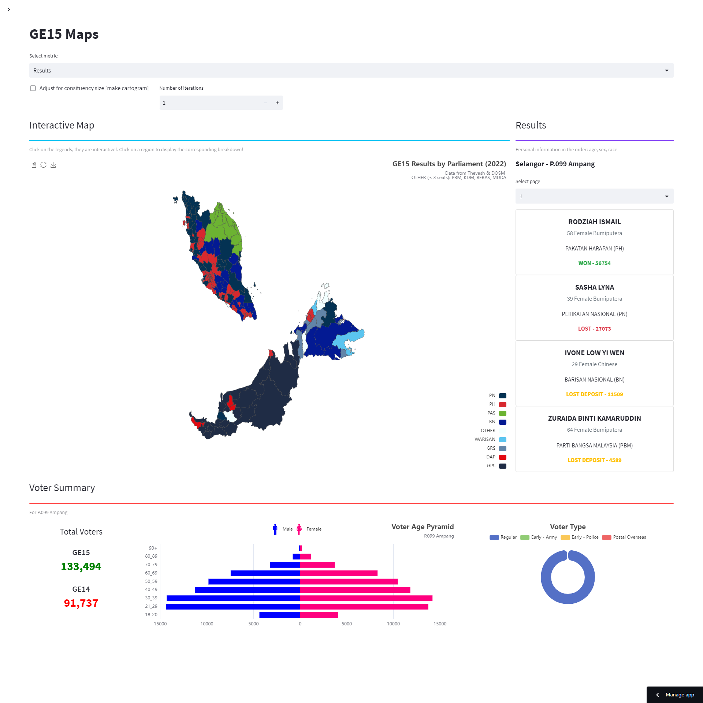

<h1 align="center" >pru-viz</h1>

 > A simple web app to visualise Malaysian election data through maps! All pull requests are welcome!

<p align="center">
    
</p>

## Quick Start

The typical `python` environment setup.

```
virtualenv venv
source venv/bin/activate
```

Install dependencies

```
pip3 install -r requirements.txt
```

Run the **entrypoint**

```
streamlit run GE15.py
```

## Folder Structure

- `data`: election & census data | `.csv` files
- `geo`: geographical boundaries | `.geojson` files
-  `pages`: the other pages
- `utils`: should have really named this **components**, contains all the shared components across the app
## Credits

All data used is extracted from [Thevesh](https://github.com/Thevesh/analysis-election-msia) and the [Department of Statistics Malaysia](https://github.com/dosm-malaysia/dataopen). 
